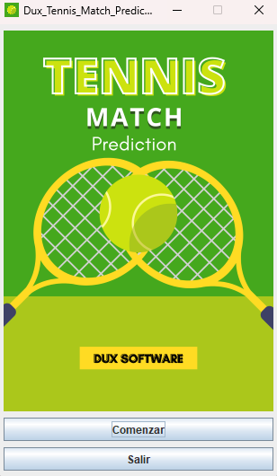
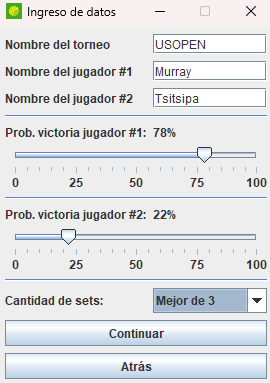
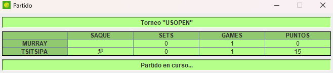
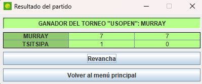

# 🏆 Dux_Tennis_Match_Prediction 

## 🔎 Sobre el programa
Este programa, creado íntegramente en Java, es parte de la evaluación técnica en el proceso de selección en DuxSoftware. Es un simulador de juegos de tenis con 2 jugadores la cual le permite al usuario determinar el resultado del partido mediante el ingreso de una predicción.

## 📝 Aclaraciones para utilización
Para jugar un partido en el simulador, primero se ingresan los nombres del torneo y de los dos jugadores participantes. Luego, se establece la probabilidad de cada jugador de ganar el partido, teniendo en cuenta que las probabilidades van de 0% a 100% y son complementarias. Finalmente, se elige si se quiere jugar un partido de 3 o 5 sets.

Una vez que se han fijado estos parámetros, se pulsa el botón "Continuar" para iniciar la simulación. Una ventana se abre para mostrar el desarrollo del partido, incluyendo quién saca en cada set y cuántos puntos, games y sets han ganado cada jugador. Durante la simulación, el usuario sólo puede ver el progreso.

Cuando la simulación haya finalizado, se muestra un resumen del partido con los resultados de cada set y el ganador. El usuario puede optar por jugar una revancha con los mismos jugadores y parámetros o volver al menú principal para comenzar otra simulación diferente.

## 💬 Comentarios
- El botón "Continuar" en la ventana de parámetros no está disponible al inicio. Para activarlo, se requiere ingresar todos los nombres solicitados (escribir en el campo de texto y presionar la tecla "Enter").
- Los nombres de los jugadores y el torneo deben estar compuestos solo de letras de la A a la Z (incluyendo la Ñ), en mayúsculas o minúsculas, con o sin acentos, con o sin espacios, y no deben tener más de 10 caracteres en total.

 ## 📥 Descarga
 Para descargar este programa haga click aquí: [release](https://github.com/lorios22/Dux_tennis_prediction/releases/tag/v0.1)

## 📸 Capturas de pantalla
\
*Ventana del menú principal*

\
*Ventana de ingreso de datos*

\
*Ventana de partido en curso*

\
*Ventana de resultado de partido*

